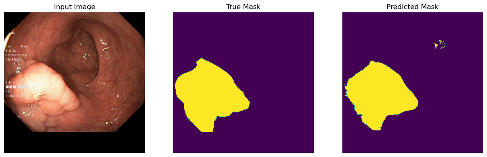
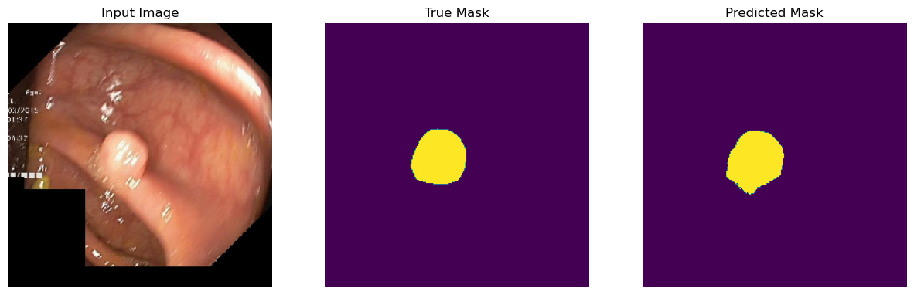
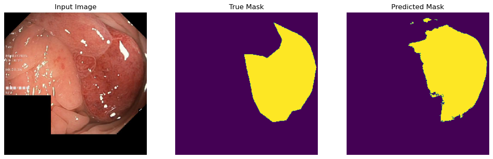
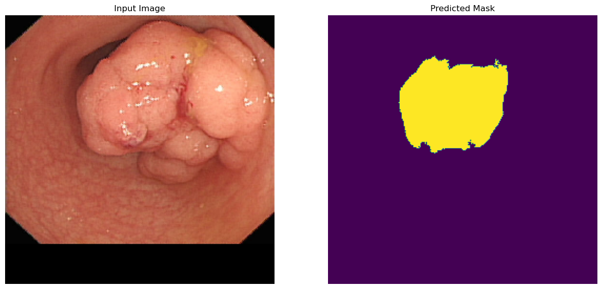
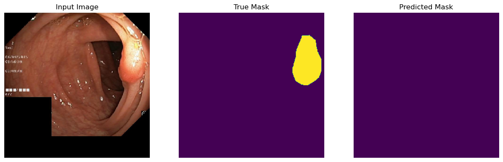
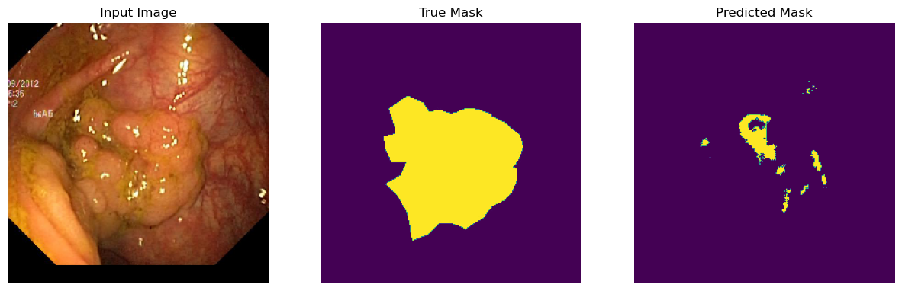

# KvasirSegmentation
U-Net implementation in TensorFlow with application to gastrointestinal polyp detection via image segmentation. Test set accuracy is 90 %, so the model is capable of solving this task, but some adjustments are required (see TODO notes).

## Sample predictions
### Good predictions

### Not so good predictions

I found the following image online and it's not from the dataset, so the true mask wasn't provided.

### Bad predictions
It's hard for the model to detect some more subtle polyps, as on the examples below.

## TODO
- [ ] Data augmentation
- [ ] Weighted loss function, to resolve the unbalanced classes issue
- [ ] Localization, then segmentation
